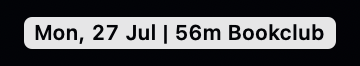
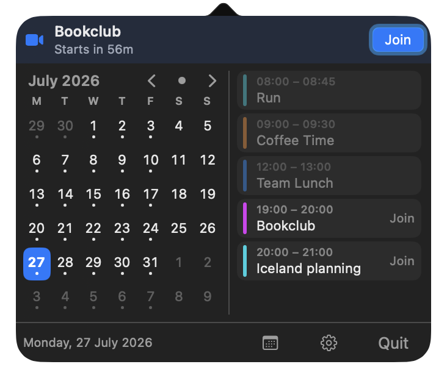
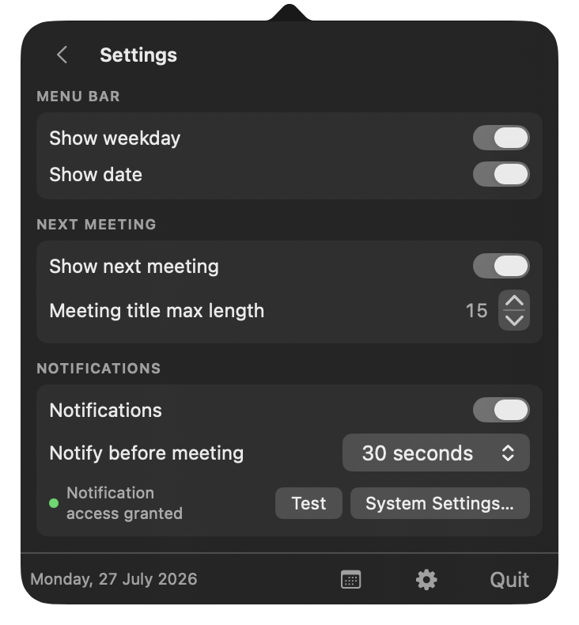

# Brief

A macOS menu bar calendar: today's date plus a countdown to your next meeting, with a month grid and one-click Join for video calls.



| Popover | Settings |
| --- | --- |
|  |  |

## Install

```sh
brew install --cask yannickpulver/tap/brief
```

Or build from source: `./build.sh`, then `open build/Brief.app` and grant calendar access when asked.

To launch at login: System Settings → General → Login Items & Extensions → Open at Login → `+` → pick `build/Brief.app`.

Screenshots use fake events: `open build/Brief.app --args --demo --popover` (or `--settings`).
